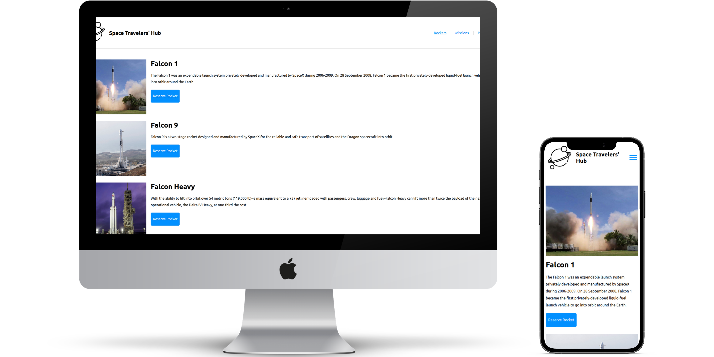

# React / Redux - Group Work: Space Travelers' Hub

> This app provides information about the rockets and missions avaliable at [SpaceX](https://www.spacex.com/).

Space Traveler' Hub is designed to allow cliant to get latest information about the space rockets and missions availiabele at [SpaceX](https://www.spacex.com/). The app allows user to reserve one or several rockets as well as join one or several space missions. All reservations and missions can be canceled by pressing the respective buttons. All reserved rockets and joined missions can also be monitored in a Profile section.

## Built With

- Major languages: JavaScript, HTML & CSS;
- Frameworks: React / Redux
- Technologies used: GitFlow, GitHub, Terminal

## Live Demo

[Live Demo](https://s-travelers-hub.netlify.app/)

## Video Demo

## Getting Started

To get a local copy up and running follow these simple example steps.

### Prerequisites

Install or update on your local terminal the node.js package.

### Setup

To get a local copy up and running follow these simple steps.

To setup the Space Travelers' Hub project in your local, in the repo page:
click on code (dropdown list) > Download as ZIP;
or open terminal of path you want to install project and run this command  
`git clone git@github.com:Hope1226/space-travelers-hub-app.git`

### Install

Run in your terminal the following commands:

**`$ cd space-travelers-hub-app/`** 
**`$ npm install`** 
**`$ npm run build`** 
**`$ npm start`**

## Authors

👤 **Ntwali Josue**

- GitHub: [@Ntwali-Josue](https://github.com/Ntwali-Josue)
- Twitter: [@JosueNtwali](https://twitter.com/JosueNtwali)
- LinkedIn: [LinkedIn](https://www.linkedin.com/in/karangwa/)

👤 **Umidjon Ustabaev (Hope)**

- GitHub: [@Hope1226](https://github.com/Hope1226)
- Twitter: [@twitterhandle](https://twitter.com/twitterhandle)
- LinkedIn: [LinkedIn](https://linkedin.com/in/linkedinhandle)

## 🤝 Contributing

Contributions, issues, and feature requests are welcome!

Feel free to check the [issues page](https://github.com/Hope1226/space-travelers-hub-app/issues).

## Show your support

Give a ⭐️ if you like this project!

## Acknowledgments

This is a project done during group work project within React / Redux Module at **[Microverse](https://www.microverse.org/)**, a remote web-developer school, using their support and frameworks provided. 
For this website, we used the [spaceX API](https://api.spacexdata.com/v3/).

## 📝 License

This project is [MIT](./MIT.md) licensed.
